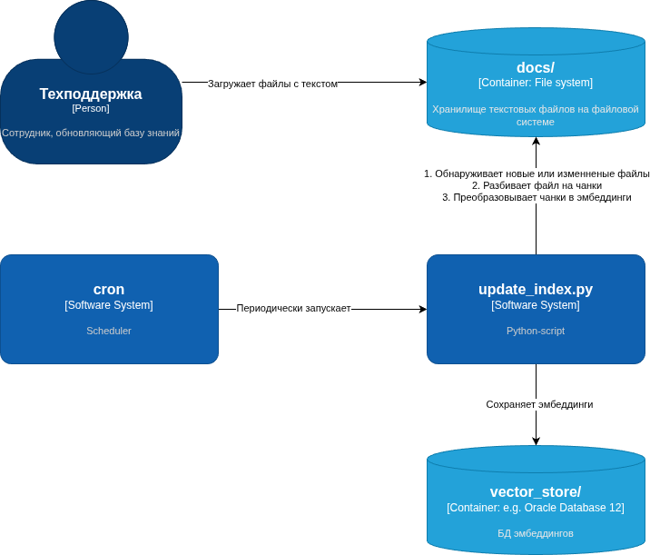

# Task 6: Автоматическое обновление векторного индекса

## Описание

Данный модуль реализует автоматизированный процесс обновления векторного индекса для RAG-системы. Скрипт автоматически находит новые или измененные документы, разбивает их на чанки, генерирует эмбеддинги и обновляет векторную базу данных FAISS.



## Структура

- `docs/` - директория для хранения документов, которые будут автоматически обработаны
- `update_index.py` - основной скрипт для обновления векторного индекса
- `vector_store/` - директория, содержащая векторный индекс и хэши файлов

## Основной скрипт: update_index.py

Скрипт выполняет следующие функции:
1. Сканирует директорию `docs/` на наличие новых или изменённых файлов
2. Рассчитывает хэши файлов для определения изменений
3. Разбивает новые/изменённые документы на чанки
4. Генерирует эмбеддинги с использованием модели all-MiniLM-L6-v2
5. Обновляет существующий векторный индекс FAISS
6. Сохраняет хэши обработанных файлов для последующего сравнения
7. Логирует процесс обновления

## Выводимая информация в лог:

- Время запуска и завершения процесса
- Количество новых чанков, добавленных в индекс
- Итоговый размер индекса
- Потенциальные ошибки

## Настройка CRON

Скрипт настроен на автоматический запуск каждую минуту через CRON:

```
* * * * * cd /home/dim/Work/architecture-pro-ai/Task6 && /home/dim/Work/architecture-pro-ai/.venv/bin/python update_index.py >> update_log.txt 2>&1
```

## Установка CRON задания

Для установки CRON задания, выполните команду:

```
crontab -l
```

Проверьте, что задание присутствует в списке. Если нет, добавьте его:

```
echo "* * * * * cd /home/dim/Work/architecture-pro-ai/Task6 && /home/dim/Work/architecture-pro-ai/.venv/bin/python update_index.py >> update_log.txt 2>&1" | crontab -
```

## Логирование

Логи записываются в файл `update_log.txt` в директории Task6, а также выводятся в стандартный поток вывода. Формат логирования: стандартный Python logging с метками времени.