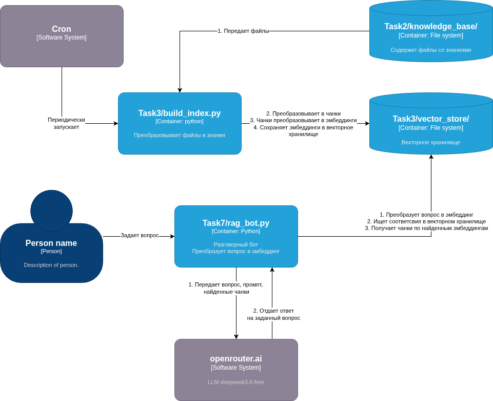

# Task7: RAG-бот с логированием запросов и анализом качества ответов

## Описание

Проект представляет собой RAG-бота с онлайн-генерацией ответов, который теперь дополнительно:
- Логирует каждый запрос с указанием следующих полей:
  - Текст запроса
  - Временная метка
  - Были ли найдены чанки
  - Длина ответа
  - Флаг "успешный ответ"
  - Найденные источники
  - Индикатор успешности ответа (knows_answer)
  - Индикатор полноты ответа (completeness_indicator)

- Обрабатывает вопросы из файла, если имя файла передано в качестве аргумента командной строки

## Где бот справляется плохо

Хуже всего он справляется с ответами на вопросы об отношениях между персонажами. Например, он не нашел ответы о том, у кого учились главные герои.

Кроме того, бот дал сбой на вопрос "на каких планетах бывал Zephon?" и посчитал, что может выдать 
чувствительную информацию.

Лучше всего расширить базу знаний, добавив более точные описание, кто с кем в каких отношениях.

## Оценка качества бота

Для этого следует запустить скрипт evaluate.py, который по golden-answers.jsonl построит статистику. Пример отчета (файл evaluation_report.txt):

ОТЧЕТ О ТЕСТИРОВАНИИ RAG-БОТА

Дата и время: 2025-12-19 22:03:00

СТАТИСТИКА СРАВНЕНИЯ:
- Совпадение по нахождению чанков:      100.00%
- Совпадение по успешности ответа:      90.00%
- Совпадение по знанию ответа:           90.00%
- Средняя разница в индикаторе полноты: 0.0000

Обработано совпадающих вопросов: 10
Всего текущих результатов:      10
Всего эталонных результатов:    10

ДЕТАЛЬНОЕ СРАВНЕНИЕ:

--------------------------------------------------------------------------------

Вопрос: где живет Zephon?
  Наши результаты:     chunks_found=True, successful_answer=False, knows_answer=True, completeness=0.800
  Эталонные результаты: chunks_found=True, successful_answer=False, knows_answer=True, completeness=0.800
  Совпадения: [✓] chunks_found, [✓] successful_answer, [✓] knows_answer, [✓] completeness

Вопрос: где родился Mordain-Fall?
  Наши результаты:     chunks_found=True, successful_answer=False, knows_answer=True, completeness=0.800
  Эталонные результаты: chunks_found=True, successful_answer=False, knows_answer=True, completeness=0.800
  Совпадения: [✓] chunks_found, [✓] successful_answer, [✓] knows_answer, [✓] completeness

Вопрос: какие родственники есть у Mordain-Fall?
  Наши результаты:     chunks_found=True, successful_answer=False, knows_answer=True, completeness=0.800
  Эталонные результаты: chunks_found=True, successful_answer=False, knows_answer=True, completeness=0.800
  Совпадения: [✓] chunks_found, [✓] successful_answer, [✓] knows_answer, [✓] completeness

Вопрос: кто такой Mordain-Fall?
  Наши результаты:     chunks_found=True, successful_answer=False, knows_answer=True, completeness=0.800
  Эталонные результаты: chunks_found=True, successful_answer=False, knows_answer=True, completeness=0.800
  Совпадения: [✓] chunks_found, [✓] successful_answer, [✓] knows_answer, [✓] completeness

Вопрос: на каких планетах бывал Mordain-Fall?
  Наши результаты:     chunks_found=True, successful_answer=False, knows_answer=True, completeness=0.800
  Эталонные результаты: chunks_found=True, successful_answer=False, knows_answer=True, completeness=0.800
  Совпадения: [✓] chunks_found, [✓] successful_answer, [✓] knows_answer, [✓] completeness

Вопрос: на каких планетах бывал Zephon?
  Наши результаты:     chunks_found=True, successful_answer=False, knows_answer=True, completeness=0.800
  Эталонные результаты: chunks_found=True, successful_answer=False, knows_answer=True, completeness=0.800
  Совпадения: [✓] chunks_found, [✓] successful_answer, [✓] knows_answer, [✓] completeness

Вопрос: сколько лет Zephon?
  Наши результаты:     chunks_found=True, successful_answer=False, knows_answer=True, completeness=0.800
  Эталонные результаты: chunks_found=True, successful_answer=True, knows_answer=False, completeness=0.800
  Совпадения: [✓] chunks_found, [✗] successful_answer, [✗] knows_answer, [✓] completeness

Вопрос: у кого учился Mordain-Fall?
  Наши результаты:     chunks_found=True, successful_answer=False, knows_answer=True, completeness=0.800
  Эталонные результаты: chunks_found=True, successful_answer=False, knows_answer=True, completeness=0.800
  Совпадения: [✓] chunks_found, [✓] successful_answer, [✓] knows_answer, [✓] completeness

Вопрос: у кого учился Soloris?
  Наши результаты:     chunks_found=True, successful_answer=False, knows_answer=True, completeness=0.800
  Эталонные результаты: chunks_found=True, successful_answer=False, knows_answer=True, completeness=0.800
  Совпадения: [✓] chunks_found, [✓] successful_answer, [✓] knows_answer, [✓] completeness

Вопрос: у кого учился Zephon?
  Наши результаты:     chunks_found=True, successful_answer=False, knows_answer=True, completeness=0.800
  Эталонные результаты: chunks_found=True, successful_answer=False, knows_answer=True, completeness=0.800
  Совпадения: [✓] chunks_found, [✓] successful_answer, [✓] knows_answer, [✓] completeness
